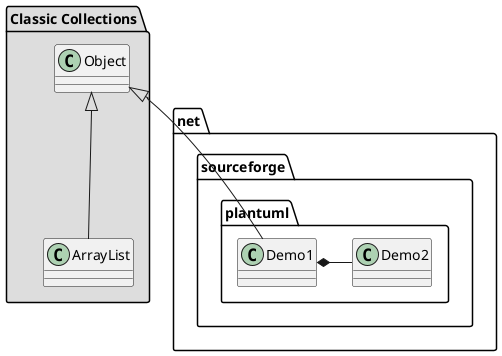

# jim
personality code

### 电子书笔记 汇总
* ZooKeeper概要 [ZooKeeper Essentails](components/src/apacheZooKeeperEssentials.md )
* 实战SpringBoot [SpringBoot In Action](spring-microservice/spring-boot/springboot-in-action/SpringBootInAction.md)
* Gradle Essential
* Redis Essential
* Netty In Action
* Rabbitmq In Action

[github集成plantuml方式--in Section:GitHub integration](https://blog.anoff.io/2018-07-31-diagrams-with-plantuml/)

