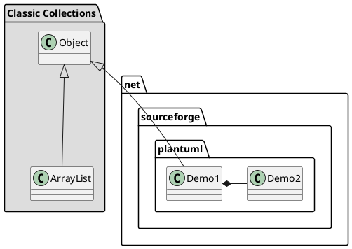

# jim
personality code

### 电子书笔记 汇总
* [ZooKeeper Essentails](components/src/apacheZooKeeperEssentials.md )
* [SpringBoot In Action](spring_microservice/spring_boot/springboot_in_action/SpringBootInAction.md)
* Gradle Essential
* Redis Essential
* Netty In Action
* Rabbitmq In Action

