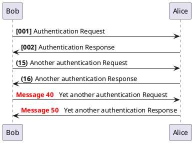
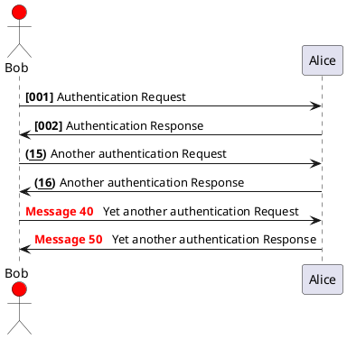
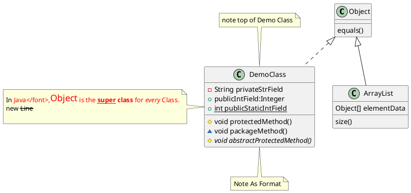

* web.xml不允许配置servlet相同的urlPattern,并且不能包含*匹配（切忌使用/,造成死循环）
* servlet init方法只在第一次调用或容器启动时触发一次(设置loadOnStart=1可以提供实例)
* servlet destroy方法随容器关闭销毁
* servlet是单实例多线程， servletContext单例，requestDiaptcher多实例

* filter在容器启动时触发init一次，容器关闭时触发destroy方法
* filter可以配置urlPatter可以使用/*，匹配所有请求路径
>> 总结
* 启动：容器启动所有Filter无序init实例，再实例化loadOnStart=1的Servlet.init()
* 调用时：按配置的filter顺序，执行每个doFilter(),再执行匹配的servlet.service()方法
>> 区别
* filter在容器时实始化，servlet可选提前实始化，也可以在第一次调用时，实例
* filter对请求进行拦截，servlet负责接受请求与响应请求

需研究tomcat源码
* * filter 1个Tomcat实例只创建1个，servlet 1个Tomcat实例，针对不同发布war包创建每一个servlet实例

